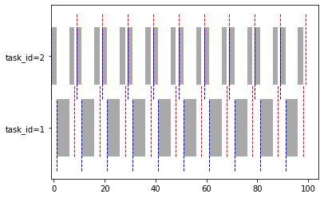
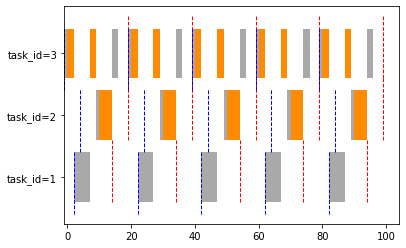
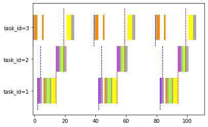
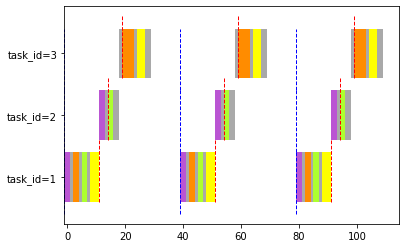

```python
from taskset import load_file_and_create_tasks , NPPScheduler , PIPScheduler , HLPScheduler,TaskSet
```


```python
npp_taskset = load_file_and_create_tasks("./taskset.json")
```

    Task Set:
    task 1: (Φ,T,C,D,∆) = (2.0, 10.0, 5.0, 7.0, [[0, 5]])
    task 2: (Φ,T,C,D,∆) = (0.0, 10.0, 5.0, 10.0, [[0, 5]])
    
    Jobs:
    [1:1] released at 2.0 -> deadline at 9.0
    [1:2] released at 12.0 -> deadline at 19.0
    [1:3] released at 22.0 -> deadline at 29.0
    [1:4] released at 32.0 -> deadline at 39.0
    [1:5] released at 42.0 -> deadline at 49.0
    [1:6] released at 52.0 -> deadline at 59.0
    [1:7] released at 62.0 -> deadline at 69.0
    [1:8] released at 72.0 -> deadline at 79.0
    [1:9] released at 82.0 -> deadline at 89.0
    [1:10] released at 92.0 -> deadline at 99.0
    [2:1] released at 0.0 -> deadline at 10.0
    [2:2] released at 10.0 -> deadline at 20.0
    [2:3] released at 20.0 -> deadline at 30.0
    [2:4] released at 30.0 -> deadline at 40.0
    [2:5] released at 40.0 -> deadline at 50.0
    [2:6] released at 50.0 -> deadline at 60.0
    [2:7] released at 60.0 -> deadline at 70.0
    [2:8] released at 70.0 -> deadline at 80.0
    [2:9] released at 80.0 -> deadline at 90.0
    [2:10] released at 90.0 -> deadline at 100.0


```python
NPPScheduler(npp_taskset).run()
```

    Validating the schedule
    no WCETs are missed 
    This schedule is feasible


    

    


```python
hlp_taskset = load_file_and_create_tasks("./taskset2.json")
```

    Task Set:
    task 1: (Φ,T,C,D,∆) = (3.0, 20.0, 5.0, 12.0, [[0, 5]])
    task 2: (Φ,T,C,D,∆) = (5.0, 20.0, 5.0, 15.0, [[0, 2], [1, 3]])
    task 3: (Φ,T,C,D,∆) = (0.0, 20.0, 9.0, 20.0, [[0, 2], [1, 5], [0, 2]])
    
    Jobs:
    [1:1] released at 3.0 -> deadline at 15.0
    [1:2] released at 23.0 -> deadline at 35.0
    [1:3] released at 43.0 -> deadline at 55.0
    [1:4] released at 63.0 -> deadline at 75.0
    [1:5] released at 83.0 -> deadline at 95.0
    [2:1] released at 5.0 -> deadline at 20.0
    [2:2] released at 25.0 -> deadline at 40.0
    [2:3] released at 45.0 -> deadline at 60.0
    [2:4] released at 65.0 -> deadline at 80.0
    [2:5] released at 85.0 -> deadline at 100.0
    [3:1] released at 0.0 -> deadline at 20.0
    [3:2] released at 20.0 -> deadline at 40.0
    [3:3] released at 40.0 -> deadline at 60.0
    [3:4] released at 60.0 -> deadline at 80.0
    [3:5] released at 80.0 -> deadline at 100.0


```python
HLPScheduler(hlp_taskset).run()
```

    Validating the schedule
    no WCETs are missed 
    This schedule is feasible


    

    


```python
pip_taskset = load_file_and_create_tasks("./taskset3.json")
```

    Task Set:
    task 1: (Φ,T,C,D,∆) = (3.0, 40.0, 12.0, 12.0, [[0, 1], [2, 2], [0, 1], [1, 2], [0, 1], [3, 2], [0, 1], [4, 2]])
    task 2: (Φ,T,C,D,∆) = (5.0, 40.0, 7.0, 15.0, [[0, 1], [2, 2], [0, 1], [3, 2], [0, 1]])
    task 3: (Φ,T,C,D,∆) = (0.0, 40.0, 11.0, 20.0, [[0, 2], [1, 4], [0, 1], [4, 3], [0, 1]])
    
    Jobs:
    [1:1] released at 3.0 -> deadline at 15.0
    [1:2] released at 43.0 -> deadline at 55.0
    [1:3] released at 83.0 -> deadline at 95.0
    [2:1] released at 5.0 -> deadline at 20.0
    [2:2] released at 45.0 -> deadline at 60.0
    [2:3] released at 85.0 -> deadline at 100.0
    [3:1] released at 0.0 -> deadline at 20.0
    [3:2] released at 40.0 -> deadline at 60.0
    [3:3] released at 80.0 -> deadline at 100.0


```python
PIPScheduler(pip_taskset).run()
```

    Validating the schedule
    This scheduler is not feasible


    

    


indirect Blocking

# Questions

## 1

تاثیر افست  بر روی پروتکل های همگام سازی :
اگر همه افست ها بکسان باشد عملا نیازی به هیچ پروتکلی نیست زیرا با الویتترین تسک ابتدا اجرا میشود
همان مثال قبلی اگر افست نباشد:


```python
data = {
    "startTime": 0,
    "endTime": 100,
    "taskset": [
        {
            "taskId": 1,
            "period": 40,
            "wcet": 12,
            "deadline": 12,
            "offset": 0,
            "sections": [[0,1],[2,2],[0,1],[1,2],[0,1],[3,2],[0,1],[4,2]]
        },
        {
            "taskId": 2,
            "period": 40,
            "wcet": 7,
            "deadline": 15,
            "offset":0 ,
            "sections": [[0,1],[2,2],[0,1],[3,2],[0,1]]
        },
        {
            "taskId": 3,
            "period": 40,
            "wcet": 11,
            "deadline": 20,
            "offset":0 ,
            "sections": [[0,2],[1,4],[0,1],[4,3],[0,1]]
        }
    ]
}
task_set = TaskSet(data)
task_set.print_tasks()
task_set.print_jobs()
PIPScheduler(task_set).run()

```

    Task Set:
    task 1: (Φ,T,C,D,∆) = (0.0, 40.0, 12.0, 12.0, [[0, 1], [2, 2], [0, 1], [1, 2], [0, 1], [3, 2], [0, 1], [4, 2]])
    task 2: (Φ,T,C,D,∆) = (0.0, 40.0, 7.0, 15.0, [[0, 1], [2, 2], [0, 1], [3, 2], [0, 1]])
    task 3: (Φ,T,C,D,∆) = (0.0, 40.0, 11.0, 20.0, [[0, 2], [1, 4], [0, 1], [4, 3], [0, 1]])
    
    Jobs:
    [1:1] released at 0.0 -> deadline at 12.0
    [1:2] released at 40.0 -> deadline at 52.0
    [1:3] released at 80.0 -> deadline at 92.0
    [2:1] released at 0.0 -> deadline at 15.0
    [2:2] released at 40.0 -> deadline at 55.0
    [2:3] released at 80.0 -> deadline at 95.0
    [3:1] released at 0.0 -> deadline at 20.0
    [3:2] released at 40.0 -> deadline at 60.0
    [3:3] released at 80.0 -> deadline at 100.0
    Validating the schedule
    This scheduler is not feasible


    

    


## 2

با افزایش تعداد ناحیه های حساس اتفاق خیلی حساسی رخ نمیدهد زیرا تسک با بالاترین اولویت تنها یکبار بلاک میشود 
